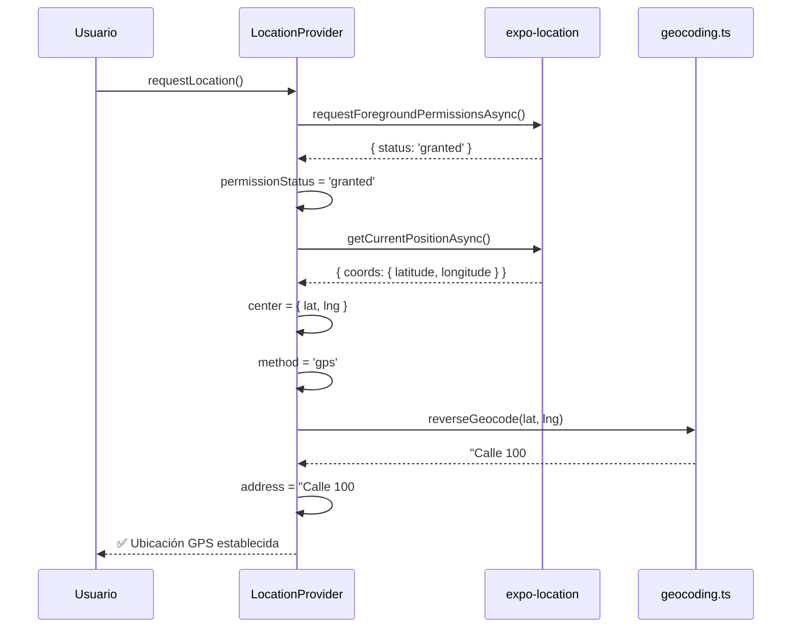
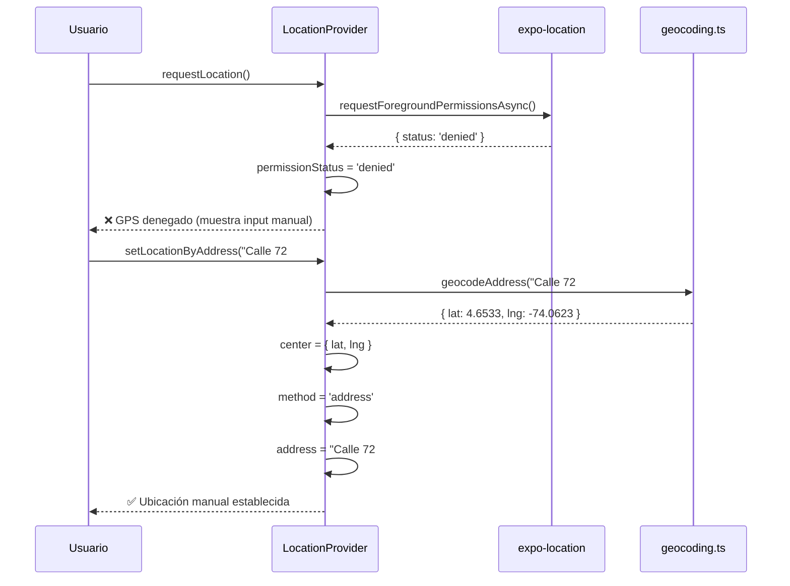

# LocationProvider - Gestión de Ubicación del Usuario

## Visión General

El sistema de ubicación del usuario combina GPS nativo con geocodificación de direcciones para determinar la posición del usuario. Incluye:

- **Permisos GPS**: Solicitud y manejo de permisos de ubicación
- **Geocodificación**: Conversión dirección ↔ coordenadas
- **Fallback Manual**: Si el usuario niega GPS, puede ingresar su dirección manualmente
- **Reverse Geocoding**: Muestra dirección legible de la ubicación GPS actual

## Arquitectura

```
┌─────────────────────────────────────────────────────────────┐
│                     LocationProvider                         │
│  - center: LatLng | null                                    │
│  - method: 'gps' | 'address' | null                         │
│  - address: string | null                                    │
│  - permissionStatus: 'granted' | 'denied' | 'undetermined'  │
│  - loading: boolean                                          │
│  - error: string | null                                      │
│                                                              │
│  + requestLocation(): Promise<void>                          │
│  + setLocationByAddress(address: string): Promise<void>      │
│  + checkPermissions(): Promise<void>                         │
│  + clearLocation(): void                                     │
└─────────────────────────────────────────────────────────────┘
                             │
                             │ uses
                             ▼
┌─────────────────────────────────────────────────────────────┐
│                      geocoding.ts                            │
│  + geocodeAddress(address: string): Promise<LatLng>         │
│  + reverseGeocode(lat: number, lng: number): Promise<str>   │
│                                                              │
│  Providers:                                                  │
│  - Google Maps Geocoding API (paid, requires API key)       │
│  - OpenStreetMap Nominatim (free, no API key)              │
└─────────────────────────────────────────────────────────────┘
                             │
                             │ uses
                             ▼
┌─────────────────────────────────────────────────────────────┐
│                      expo-location                           │
│  + requestForegroundPermissionsAsync()                       │
│  + getForegroundPermissionsAsync()                           │
│  + getCurrentPositionAsync()                                 │
└─────────────────────────────────────────────────────────────┘
```

## Instalación y Configuración

### 1. Instalar expo-location

```bash
npx expo install expo-location
```

### 2. Configurar Proveedor de Geocoding

Edita `.env` (crea desde `.env.example`):

```bash
# Provider de geocoding: 'google' o 'nominatim'
# nominatim = gratis, no requiere API key
# google = pago, requiere EXPO_PUBLIC_GOOGLE_MAPS_API_KEY
EXPO_PUBLIC_GEOCODING_PROVIDER=nominatim

# Solo necesario si usas provider 'google'
# EXPO_PUBLIC_GOOGLE_MAPS_API_KEY=your_api_key_here
```

**Recomendación**: Usa `nominatim` para desarrollo (gratis). Para producción, considera Google Maps API para mejor precisión.

### 3. Configurar Permisos en app.json

```json
{
  "expo": {
    "plugins": [
      [
        "expo-location",
        {
          "locationAlwaysAndWhenInUsePermission": "Permite a WeNearBy acceder a tu ubicación para mostrarte tiendas cercanas."
        }
      ]
    ]
  }
}
```

## Uso

### Envolver la App con LocationProvider

```tsx
// app/_layout.tsx
import { LocationProvider } from '@/context/LocationProvider';

export default function RootLayout() {
  return (
    <LocationProvider>
      {/* Resto de tu app */}
      <Stack>
        <Stack.Screen name="(tabs)" options={{ headerShown: false }} />
      </Stack>
    </LocationProvider>
  );
}
```

### Consumir el Context

```tsx
import { useLocation } from '@/context/LocationProvider';

function StoreListScreen() {
  const {
    center,
    method,
    address,
    permissionStatus,
    loading,
    error,
    requestLocation,
    setLocationByAddress,
    checkPermissions,
    clearLocation,
  } = useLocation();

  // Solicitar GPS al montar
  useEffect(() => {
    requestLocation();
  }, []);

  if (!center) {
    return (
      <View>
        <Text>Necesitamos tu ubicación para mostrar tiendas cercanas</Text>
        <Button title="Solicitar GPS" onPress={requestLocation} />
        
        {permissionStatus === 'denied' && (
          <View>
            <Text>GPS denegado. Ingresa tu dirección manualmente:</Text>
            <TextInput
              placeholder="Ej: Calle 100 #15-20, Bogotá"
              onSubmitEditing={(e) => setLocationByAddress(e.nativeEvent.text)}
            />
          </View>
        )}
      </View>
    );
  }

  return (
    <View>
      <Text>Ubicación: {address || `${center.lat}, ${center.lng}`}</Text>
      <Text>Método: {method === 'gps' ? 'GPS' : 'Dirección Manual'}</Text>
      
      {/* Aquí va tu lista de tiendas usando center */}
      <StoreList center={center} />
    </View>
  );
}
```

## API Reference

### LocationProvider Props

```typescript
interface LocationContextValue {
  // Estado
  center: LatLng | null;                    // Coordenadas actuales
  method: LocationMethod;                   // 'gps' | 'address' | null
  address: string | null;                   // Dirección legible (si hay reverse geocoding)
  permissionStatus: LocationPermissionStatus; // 'granted' | 'denied' | 'undetermined'
  loading: boolean;
  error: string | null;

  // Acciones
  requestLocation: () => Promise<void>;     // Solicita GPS
  setLocationByAddress: (address: string) => Promise<void>; // Geocodifica dirección
  checkPermissions: () => Promise<void>;    // Verifica permisos actuales
  clearLocation: () => void;                // Limpia ubicación
}
```

### Funciones de Geocoding

```typescript
// Convertir dirección → coordenadas
async function geocodeAddress(address: string): Promise<LatLng> {
  // Lanza error si no se encuentra
}

// Convertir coordenadas → dirección legible
async function reverseGeocode(lat: number, lng: number): Promise<string> {
  // Lanza error si falla
}
```

## Flujos de Usuario

### Flujo 1: Usuario Acepta GPS



### Flujo 2: Usuario Niega GPS → Dirección Manual



## Providers de Geocoding

### Nominatim (OpenStreetMap) - GRATIS

**Ventajas**:
- ✅ Gratis, sin límites estrictos
- ✅ No requiere API key
- ✅ Datos abiertos (OpenStreetMap)

**Desventajas**:
- ❌ Menos preciso en direcciones complejas
- ❌ Más lento (~1-2s de latencia)
- ❌ Requiere User-Agent en headers

**Uso de API**:
```typescript
// Geocoding (dirección → coordenadas)
const url = `https://nominatim.openstreetmap.org/search?q=${encodeURIComponent(address)}&format=json&limit=1`;
fetch(url, { headers: { 'User-Agent': 'WeNearByApp/1.0' } });

// Reverse Geocoding (coordenadas → dirección)
const url = `https://nominatim.openstreetmap.org/reverse?lat=${lat}&lon=${lng}&format=json`;
fetch(url, { headers: { 'User-Agent': 'WeNearByApp/1.0' } });
```

### Google Maps Geocoding API - PAGO

**Ventajas**:
- ✅ Muy preciso, incluso con direcciones incompletas
- ✅ Rápido (~200-500ms de latencia)
- ✅ Mejor cobertura global
- ✅ Sugerencias de autocompletar (con Places API)

**Desventajas**:
- ❌ Requiere API key
- ❌ Costo: $5 USD por 1000 requests (ver [pricing](https://mapsplatform.google.com/pricing/))
- ❌ Requiere cuenta de billing

**Uso de API**:
```typescript
// Geocoding (dirección → coordenadas)
const url = `https://maps.googleapis.com/maps/api/geocode/json?address=${encodeURIComponent(address)}&key=${apiKey}`;
fetch(url);

// Reverse Geocoding (coordenadas → dirección)
const url = `https://maps.googleapis.com/maps/api/geocode/json?latlng=${lat},${lng}&key=${apiKey}`;
fetch(url);
```

**Costo Estimado**:
- 1000 usuarios/día, 1 geocoding + 1 reverse geocoding = 2000 requests/día
- 2000 × 30 días = 60,000 requests/mes
- Costo: ~$300 USD/mes

## Testing

### Test Screen Interactivo

```bash
# Abre la app en el simulador
npx expo start

# Navega a:
http://localhost:8081/__tests__/location-test
```

**Casos de prueba**:
1. ✅ Solicitar GPS → Aceptar → Ver coordenadas y dirección reverse geocoded
2. ✅ Solicitar GPS → Denegar → Ingresar dirección manual → Ver coordenadas
3. ✅ Verificar que `permissionStatus` se actualiza correctamente
4. ✅ Verificar que `method` distingue entre 'gps' y 'address'
5. ✅ Limpiar ubicación y volver a solicitar

### Ejemplo de UI de Test

```tsx
// app/__tests__/location-test.tsx (simplificado)
function LocationTestContent() {
  const {
    center,
    method,
    address,
    permissionStatus,
    loading,
    error,
    requestLocation,
    setLocationByAddress,
    clearLocation,
  } = useLocation();

  return (
    <ScrollView>
      {/* Estado de permisos */}
      <Text>Permisos: {permissionStatus}</Text>
      
      {/* Botón para solicitar GPS */}
      <Button title="Solicitar GPS" onPress={requestLocation} disabled={loading} />
      
      {/* Input para dirección manual */}
      <TextInput
        placeholder="Ej: Calle 100 #15-20, Bogotá"
        onSubmitEditing={(e) => setLocationByAddress(e.nativeEvent.text)}
      />
      
      {/* Mostrar ubicación actual */}
      {center && (
        <View>
          <Text>Coordenadas: {center.lat}, {center.lng}</Text>
          <Text>Método: {method}</Text>
          <Text>Dirección: {address || 'No disponible'}</Text>
        </View>
      )}
      
      {/* Botón para limpiar */}
      <Button title="Limpiar Ubicación" onPress={clearLocation} />
    </ScrollView>
  );
}
```

## Manejo de Errores

### Errores de Geocoding

```typescript
try {
  await setLocationByAddress('dirección inválida');
} catch (error) {
  // Error típico: "No se pudo encontrar la dirección"
  console.error(error);
}
```

### Errores de GPS

```typescript
try {
  await requestLocation();
} catch (error) {
  // Errores comunes:
  // - "Permisos de ubicación denegados"
  // - "No se pudo obtener la ubicación GPS"
  console.error(error);
}
```

### Mostrar Errores al Usuario

```tsx
const { error, permissionStatus } = useLocation();

{error && (
  <View style={{ backgroundColor: '#fee', padding: 10 }}>
    <Text style={{ color: 'red' }}>{error}</Text>
  </View>
)}

{permissionStatus === 'denied' && (
  <View>
    <Text>⚠️ GPS denegado. Opciones:</Text>
    <Text>1. Ingresa tu dirección manualmente</Text>
    <Text>2. Ve a Ajustes → WeNearBy → Ubicación → Permitir</Text>
  </View>
)}
```

## Integración con StoreService

```tsx
import { useLocation } from '@/context/LocationProvider';
import { StoreService } from '@/services/stores/store.service';

function NearbyStoresScreen() {
  const { center, loading: locationLoading } = useLocation();
  const [stores, setStores] = useState<Store[]>([]);

  useEffect(() => {
    if (!center) return;

    // Buscar tiendas cercanas usando la ubicación del usuario
    StoreService.listNearby({
      center,
      radiusKm: 5, // 5 km de radio
      maxResults: 20,
      filters: {
        isOpen: true,
        hasDelivery: true,
      },
    }).then(setStores);
  }, [center]);

  if (locationLoading || !center) {
    return <Text>Obteniendo tu ubicación...</Text>;
  }

  return (
    <FlatList
      data={stores}
      renderItem={({ item }) => (
        <StoreCard store={item} userLocation={center} />
      )}
    />
  );
}
```

## Best Practices

### 1. Solicitar GPS al Momento Apropiado

❌ **Malo**: Solicitar GPS al abrir la app (splash screen)
```tsx
function App() {
  const { requestLocation } = useLocation();
  
  useEffect(() => {
    requestLocation(); // ❌ Usuario no sabe por qué se solicita
  }, []);
}
```

✅ **Bueno**: Solicitar GPS cuando el usuario navega a pantalla que necesita ubicación
```tsx
function StoresScreen() {
  const { requestLocation, center } = useLocation();
  
  useEffect(() => {
    if (!center) {
      // Mostrar pantalla explicativa primero
      setShowLocationExplanation(true);
    }
  }, []);

  const handleAcceptLocationRequest = () => {
    requestLocation(); // ✅ Usuario entiende el contexto
  };
}
```

### 2. Cachear Ubicación

❌ **Malo**: Solicitar GPS en cada navegación
```tsx
function StoresScreen() {
  const { requestLocation } = useLocation();
  
  useFocusEffect(() => {
    requestLocation(); // ❌ Solicita GPS cada vez que vuelve a la pantalla
  });
}
```

✅ **Bueno**: Usar ubicación cacheada si es reciente
```tsx
function StoresScreen() {
  const { center, requestLocation } = useLocation();
  
  useEffect(() => {
    if (!center) {
      requestLocation(); // ✅ Solo solicita si no hay ubicación
    }
  }, [center]);
}
```

### 3. Manejar Loading States

❌ **Malo**: No mostrar feedback durante geocoding
```tsx
<Button title="Geocodificar" onPress={() => setLocationByAddress(text)} />
```

✅ **Bueno**: Mostrar loading indicator
```tsx
const { loading, setLocationByAddress } = useLocation();

<Button 
  title={loading ? "Geocodificando..." : "Geocodificar"}
  onPress={() => setLocationByAddress(text)}
  disabled={loading}
/>
```

### 4. Validar Dirección Antes de Geocodificar

✅ **Bueno**: Validación básica
```tsx
const handleGeocodeAddress = async (address: string) => {
  if (address.trim().length < 10) {
    Alert.alert('Error', 'Ingresa una dirección completa (ej: Calle 100 #15-20, Bogotá)');
    return;
  }
  
  try {
    await setLocationByAddress(address);
  } catch (error) {
    Alert.alert('Error', 'No se pudo encontrar la dirección. Verifica que sea correcta.');
  }
};
```

## Troubleshooting

### "No se pudo obtener la ubicación GPS"

**Causas comunes**:
1. Usuario está en interiores (GPS débil)
2. Simulador no tiene ubicación configurada
3. Permisos revocados a nivel de sistema

**Soluciones**:
```tsx
// Opción 1: Aumentar timeout y accuracy
await getCurrentPositionAsync({
  accuracy: Location.Accuracy.Balanced, // Menos preciso pero más rápido
  timeInterval: 10000, // 10 segundos de timeout
});

// Opción 2: Ofrecer dirección manual inmediatamente
if (permissionStatus === 'granted' && error?.includes('GPS')) {
  // Mostrar input de dirección manual como fallback
}
```

### "No se pudo encontrar la dirección"

**Causas comunes**:
1. Dirección incompleta o con typos
2. Nominatim no reconoce la dirección (menos cobertura que Google)
3. Falta de internet

**Soluciones**:
```tsx
// Sugerir formato correcto
<Text>Formato sugerido: Calle/Carrera ##-##, Ciudad</Text>

// Ejemplo de validación
const isValidAddress = (addr: string) => {
  return addr.includes(',') && addr.length > 10;
};
```

### Provider Nominatim Lento

**Solución**: Cambiar a Google Maps API (pago)
```bash
# .env
EXPO_PUBLIC_GEOCODING_PROVIDER=google
EXPO_PUBLIC_GOOGLE_MAPS_API_KEY=tu_api_key
```

## Roadmap / Mejoras Futuras

- [ ] **Autocompletar Direcciones**: Integrar Google Places Autocomplete para sugerencias
- [ ] **Cache de Geocoding**: Guardar resultados en AsyncStorage para reducir API calls
- [ ] **Detección Automática de Ciudad**: Usar reverse geocoding para preseleccionar ciudad
- [ ] **Validación de Cobertura**: Verificar que la dirección esté dentro del área de servicio
- [ ] **Background Location**: Actualizar ubicación automáticamente cuando cambia (opcional)
- [ ] **Mapas Interactivos**: Permitir que el usuario elija ubicación arrastrando un pin en mapa

## Recursos

- [expo-location docs](https://docs.expo.dev/versions/latest/sdk/location/)
- [Google Maps Geocoding API](https://developers.google.com/maps/documentation/geocoding/overview)
- [Nominatim API](https://nominatim.org/release-docs/latest/api/Overview/)
- [Haversine Formula](https://en.wikipedia.org/wiki/Haversine_formula)

---

**Documentación generada**: 2024-01-XX  
**Versión expo-location**: 19.0.7  
**Versión Expo SDK**: 54.0.2
